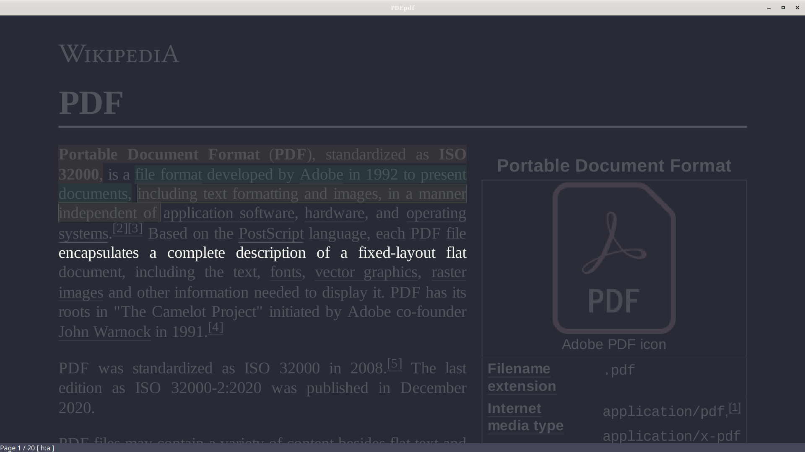

# Dracula for [sioyek](https://sioyek.info)

> A dark theme for [Sioyek](https://sioyek.info).



## Install

1. Compile latest development version of sioyek
2. Clone this repo
	```
	git clone https://github.com/raffaem/sioyek-dracula-theme
	```
3. Copy theme file to sioyek config directory
	```
	cp ./dracula.config ~/.config/sioyek
	```
4. Source the theme file
	```
	echo "source dracula.config" >> ~/.config/sioyek/prefs_user.config
	```
5. Make sure there is a `toggle_custom_color` option in `startup_commands` of `~/.config/sioyek/prefs_user.config`.
	
	If you don't have  `startup_commands`, add it:
	```
	echo "startup_commands toggle_custom_color" >> ~/.config/sioyek/prefs_user.config
	```


<!-- All instructions can be found at [draculatheme.com/foobar](https://draculatheme.com/foobar) -->

## Team

This theme is maintained by the following person(s)
<!-- and a bunch of [awesome contributors](https://github.com/dracula/foobar/graphs/contributors) [TODO]. -->

|[](https://github.com/raffaem)|
|-|
|[Raffaele Mancuso](https://github.com/raffaem)|

## Community

- [Twitter](https://twitter.com/draculatheme) - Best for getting updates about themes and new stuff.
- [GitHub](https://github.com/dracula/dracula-theme/discussions) - Best for asking questions and discussing issues.
- [Discord](https://draculatheme.com/discord-invite) - Best for hanging out with the community.

## License

[MIT License](./LICENSE)
